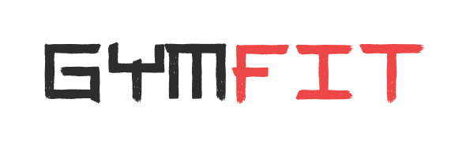

 
 

 
 
  

    <a href="https://tai-chi.vercel.app/">View Demo</a>
    &nbsp;·&nbsp;
    <a href="https://github.com/stefanbrkic1/tai-chi/issues">Report Bug</a>
    &nbsp;·&nbsp;
    <a href="https://github.com/stefanbrkic1/tai-chi/issues">Request Feature</a>
  

 
<!-- ABOUT THE PROJECT -->

## Preview

.jpg>)
.jpg>)

> **Note**
>
> > Application is still under Development

 

## Tai Chi | Website for Tai Chi Academy

This project is a responsive website for a Tai Chi Academy, built using ReactJS. It features seamless navigation with React Routing and dynamic route paths for efficient URL management. The site integrates a News API to provide the latest updates about Tai Chi and uses the Unsplash API to create a dynamic gallery of Tai Chi-related images. The responsive design ensures the website is accessible and visually appealing on all devices, offering users an engaging and informative online experience.

 

## Built With

 &nbsp;&nbsp;&nbsp;&nbsp; &nbsp;&nbsp; &nbsp;&nbsp; &nbsp;&nbsp;

 

## Tools Used

  
 &nbsp;&nbsp; &nbsp;&nbsp; &nbsp;&nbsp; &nbsp;&nbsp; &nbsp;&nbsp; &nbsp;&nbsp; &nbsp;&nbsp; &nbsp;&nbsp; &nbsp;&nbsp; &nbsp;&nbsp; &nbsp;&nbsp;

 

## Features

- **React Routing**: Implemented for seamless navigation across different pages.

- **Dynamic Route Path**: Allows for flexible and efficient URL management.

- **News Integration**: Integrated with a News API to provide the latest news about Tai Chi.

- **Gallery**: Utilizes the Unsplash API to display a dynamic gallery of Tai Chi-related images.

- **Cross-Browser Compatibility**: Ensure smooth performance across various web browsers.

- **Responsive Design**: Ensures the website is accessible and visually appealing on all devices, from desktops to mobile phones.

- **Code Formatting Guidelines**: The project adheres to coding standards and maintains code consistency by implementing ESLint along with Prettier for code formatting.

 

## Author

👤 **Stefan Brkic**

- GitHub: [stefanbrkic1](https://github.com/stefanbrkic1)
- LinkedIn: [Stefan Brkic](https://www.linkedin.com/in/stefan-brkic-4014012a3/)
